# Facial-Emotion-Recognition-using-NodeRED
This repository aims to introduce NodeRED and  provide the reader the starting points through which he/she can build a dashboard that utilizes a Facial Emotion Recognition (FER) api and NodeRED as well as generate a website displaying Cards of People of Determination. This was inspired from the application "LOOK AT ME" that is aimed at Autistic children. LOOK AT ME app gamifies interactions, helping users learn to read moods, remember faces, and express themselves with facial expressions and poses. Children with autism spectrum conditions (ASC) have major difficulties in recognizing and responding to emotional and mental states in others' facial expressions. Such difficulties in empathy underlie their social-communication difficulties that form a core of the diagnosis (https://www.ncbi.nlm.nih.gov/pmc/articles/PMC2781897/).


## Node-RED on IBM Cloud

Node-RED is an open source visual flow-based programming tool used for wiring not only Internet of Things (IoT) components, but also integrating an ensemble of service APIs, including ones provided by IBM Cloud. A node in NodeRED performs a particular functionality, aiming at providing a way to minimize the amount of coding needed to build a given application.

More information about Node-RED, including the documentation, can be found [here](https://nodered.org/).

## Quick Overview
There are two parts to this repository:
- You will be able to use an external package in NodeRED that retrieves emotion based on the face detected within an image and display the dominant facial emotional expression on a dashboard.
- You will be able to send an HTTP request to get dataset related to Cards of People of Determination in UAE as well as generate an HTTP end-point to create a simple sample website.

## Pre-requisite

* An IBM Cloud account - can be created through going to [IBM Cloud](http://ibm.biz/healthhack).
* An account on [Face++ Cognitive Services](https://console.faceplusplus.com/) to retrieve an API key.

## Face++ Cognitive Services API

1) After creating an account, go to [API Key](https://console.faceplusplus.com/app/apikey/list
) page.

2) Click **+ Get API Key**.

3) Enter the required details and click **Submit**.

4) Copy generate **API Key** and **API Secret**, which you will use within the upcoming flow in NodeRED.

## Creating the Node-RED Application

1) Go to **Catalog** and select **Node-RED Starter** under the category **Starter Kits**

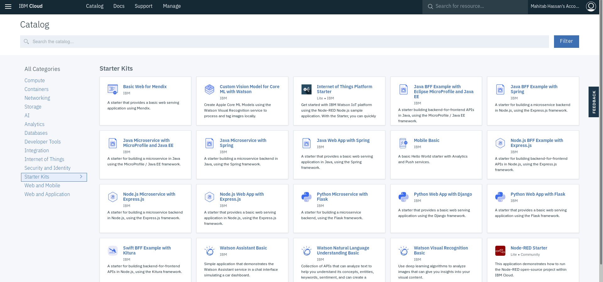

2) Enter an **App name** and a unique **Host name** along with selecting the approprate **region/location**, **organization** and **space**.

3) Click **Create**

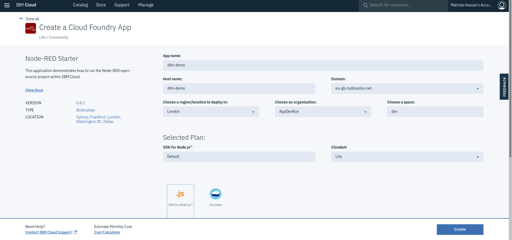

An instance of the Node-RED application (which uses Node.js to create server-side JavaScript applications) is created to which a **Cloudant NoSQL** database is bound. It will take some time for the application status to change to **Running**, indicating that it is running.

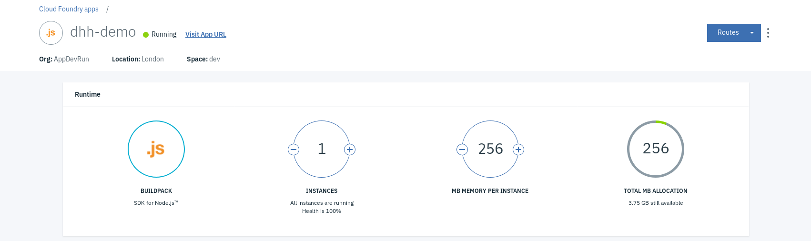

## 


## Making [face-plusplus-node](https://www.npmjs.com/package/face-plusplus-node) (an external package) to the Function Nodes in NodeRED

1) Under **Overview**, click on **Enable** under **Continuous delivery** to, as the naming suggests, enable continous delivery
2) Confirm all the details and click on **Create**
3) Click on **Eclipse Orion Web IDE** to open the online editor

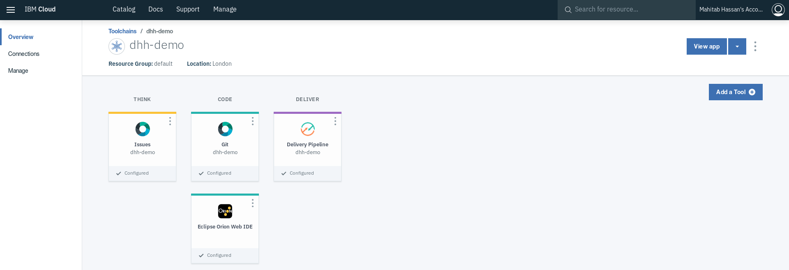

4) Go to bluemix-setting.js
5) Find the definition of the functionGlobalContext object and add face-plusplus-node
```javascript
functionGlobalContext: {
  fpp:require("face-plusplus-node")
},
```

6) Define it as a dependency in the package.json file
```JSON
"dependencies": {
   ...,
  "face-plusplus-node": "latest"
},
```

7) Save the modifications, go to Git in the editor, commit and push all changes

8) Wait for restaging to take place and check if the application is running again


## Creating **CloudantNoSQL** database where data is store


1) As the database is already created and bound to this application, simply got to **Connections** and select the database.

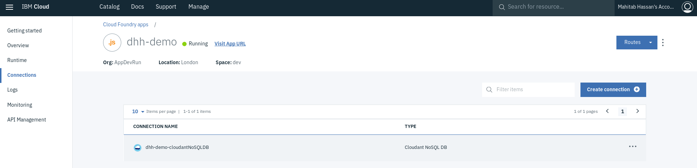

2) Click the name on the right of **Alias of** to access the Cloudant SQL DB service.

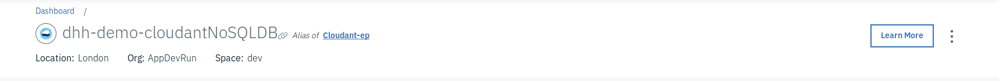

3) Click **LAUNCH CLOUDANT DASHBOARD**.

4) Click **Create Database** and enter the name of the database (in our case, enter *faceplusplus*).

5) Click **Create**.


## Setting Up the Node-RED Application & a Quick Tour

1) Go back to the application from the IBM Cloud Dashboard and click **Visit App URL** to access the Node-RED editor used to build the application.

2) Follow the directions to access the Node-RED editor (you are encouraged to secure your Node-RED editor to ensure that only authorized users can access it).

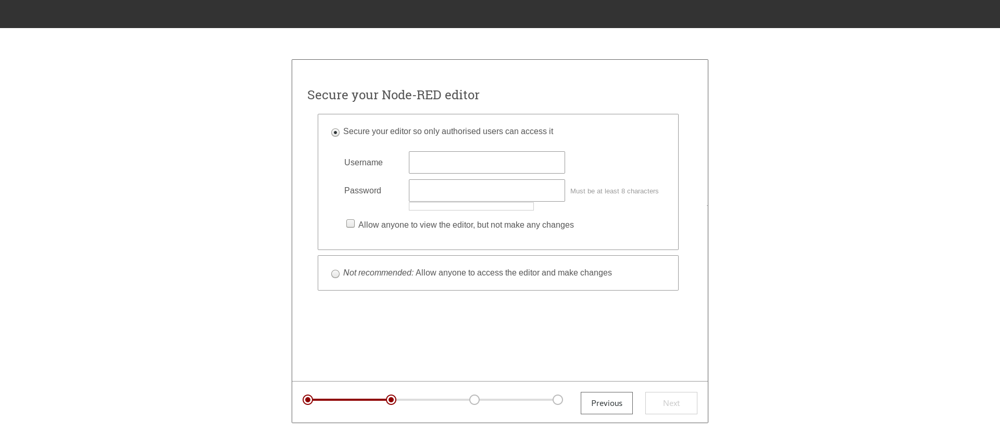

* Click on **Go to your Node-RED flow editor**. This should open a fresh new flow in the Node-RED flow editor called *Flow 1*

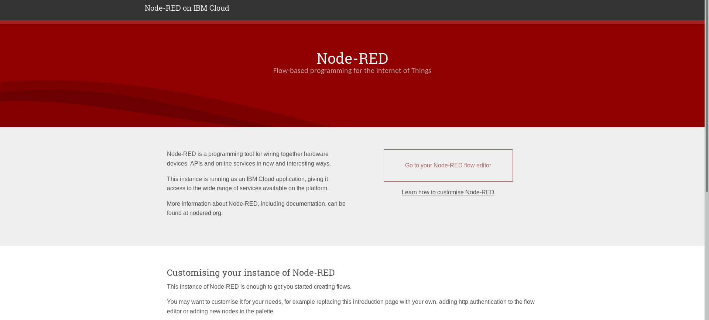


## Creating the flows
### Part 1: Facial Emotional Recognition
1) Go to the hamburger menu and select **Manage palette** (this is to install nodes needed)

2) Click on **Install** tab, look for **node-red-contrib-browser-utils**, **node-red-node-base64**, and **node-red-dashboard** and install each.

3) Go to the hamburger menu and select **Clipboard** under **Import**.

4) Paste the content emotionrecogition_flow.json from this repository and click **Import**.

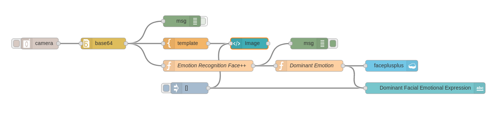

5) Double click on the function node called *Emotion Recognition Face++* and replace *<APIKEY>* and *<APISECRET>* with the Api Key and API Secret that you copied earlier. 

6) Double click on template node called *Image* and click on the button with pencil icon to add this to a **new ui_group**.

7) Confirm the configuration of the **new dashboard group config node** (make sure the width is 7) and click **Add**.

8) Click Done

9) Double click on template node called *Dominant Facial Emotional Expression* and added to the Group you created.

You can confirm that the dashboard components were added correctly by view the dashboard tab on the right.

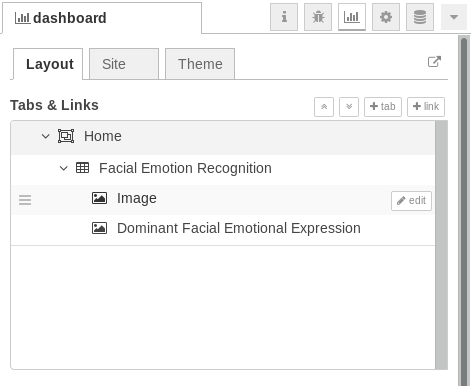

10) Click **Deploy** and test it out by click button on the camera node and go to https://<HOSTNAME>.eu-gb.mybluemix.net/ui/ , replacing <HOSTNAME> with your application's hostname, to view the results on the dashboard (you can also click the button with the arrow comming out of the box icon under the **dashboard** tab to got to the dashboard).

### Part 2: Creating a sample website

1) Paste the content samplewebpage_flow.json from this repository and click **Import**.

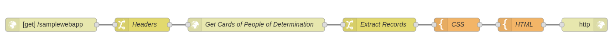

2) Explore each node to understand what is happening in relation to creating an HTTP endpoint and using an HTTP request node.

3) Go to https://<HOSTNAME>.eu-gb.mybluemix.net/samplewebapp to check out the webpage you just created.


## Additional Resources to Explore

[Can emotion recognition be taught to children with autism spectrum conditions?](https://www.ncbi.nlm.nih.gov/pmc/articles/PMC2781897/)

[Look At Me - The New App Aiding Kids with Autism [VIDEO]](https://www.goodnet.org/articles/new-app-aiding-kids-autism-video)

[Look At Me: How to and Review](https://news.samsung.com/global/look-at-me-how-to-and-review)

[face-plusplus-node](https://www.npmjs.com/package/face-plusplus-node)

[Creating a Node-RED deployment pipeline to IBM Cloud](https://medium.com/@knolleary/creating-a-node-red-deployment-pipeline-to-ibm-cloud-9a8e9d5113de)

[NodeRED roadmap](http://noderedguide.com/)

[NodeRED documentation](https://nodered.org/docs/)

[NodeRED guide](http://noderedguide.com/)

[People of Determination (People with disabilities) dataset](http://data.bayanat.ae/en_GB/dataset/card-for-people-with-disabilities-people-of-determination)

[Dashboard template examples](https://it.knightnet.org.uk/kb/nr-qa/dashboard-template-examples/)

[NodeRED Angular HTTP](https://github.com/victorklijmeij/nod-red-angular-http/)

[Create a web interface using Node-RED to trigger an IBM Watson Studio analytics workflow](https://developer.ibm.com/code/patterns/orchestrate-data-science-workflows-using-node-red/)
